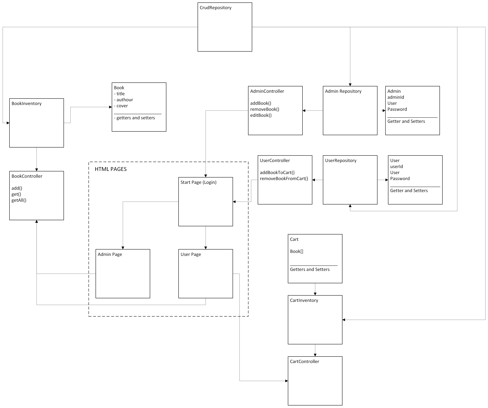
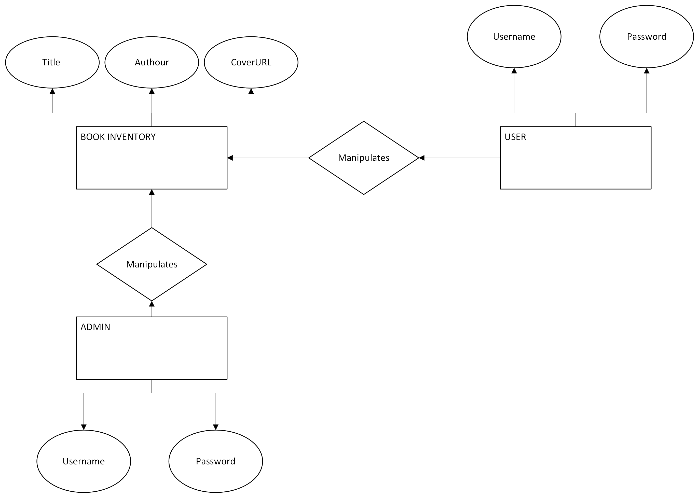
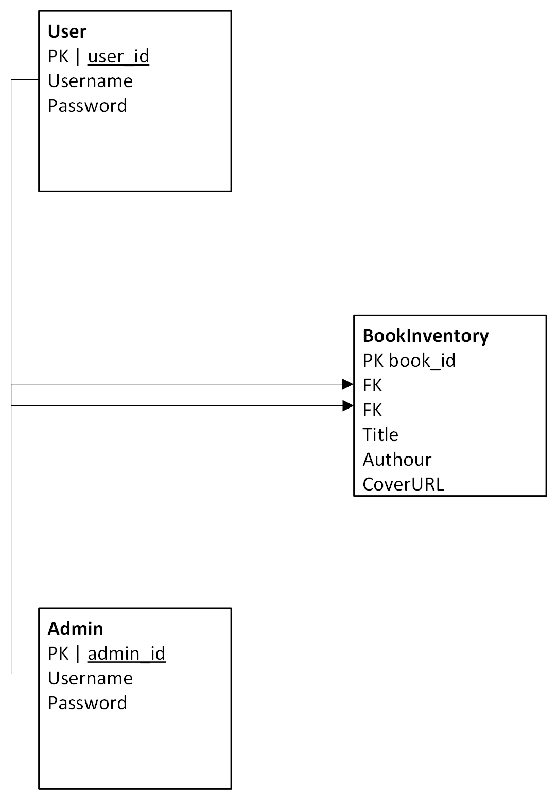

# BookStore :: Amazin.ca 🛒

A modern online bookstore application built with Spring Boot.

## Overview

Amazin.ca is an online bookstore platform that allows users to browse, search, and purchase books. The application is built using Spring Boot and can be deployed locally or accessed through Azure cloud platform.

## System Architecture

### UML Diagram



### Entity Relationship Diagram


### Entity Relationship Map


## Running the Application

There are several ways to run the BookStore application:

### 1. Using Terminal with Maven Wrapper
```bash
cd app
./mvnw spring-boot:run
```

### 2. Building and Running JAR
```bash
# Build the application
cd app
./mvnw clean package

# Run the JAR
cd target
java -jar app-0.0.1-SNAPSHOT.jar
```

### 3. Azure Cloud Deployment
Access the live application at:
[https://amazinonlinebookstore-fzhdb7arcjctabbq.canadaeast-01.azurewebsites.net](https://amazinonlinebookstore-fzhdb7arcjctabbq.canadaeast-01.azurewebsites.net)

## Prerequisites
- Java 21 or higher
- Maven
- Internet connection (for accessing Azure deployment)

## Features
- Browse and search books
- User authentication
- Shopping cart functionality
- Order management
- Secure checkout process

## Technology
- Spring Boot
- Spring Data JPA
- Spring Security
- Maven
- Azure Cloud Services


## Support
For any issues or questions, please open an issue in the repository or contact the development team.

## License
This project is licensed under the MIT License - see the LICENSE file for details.