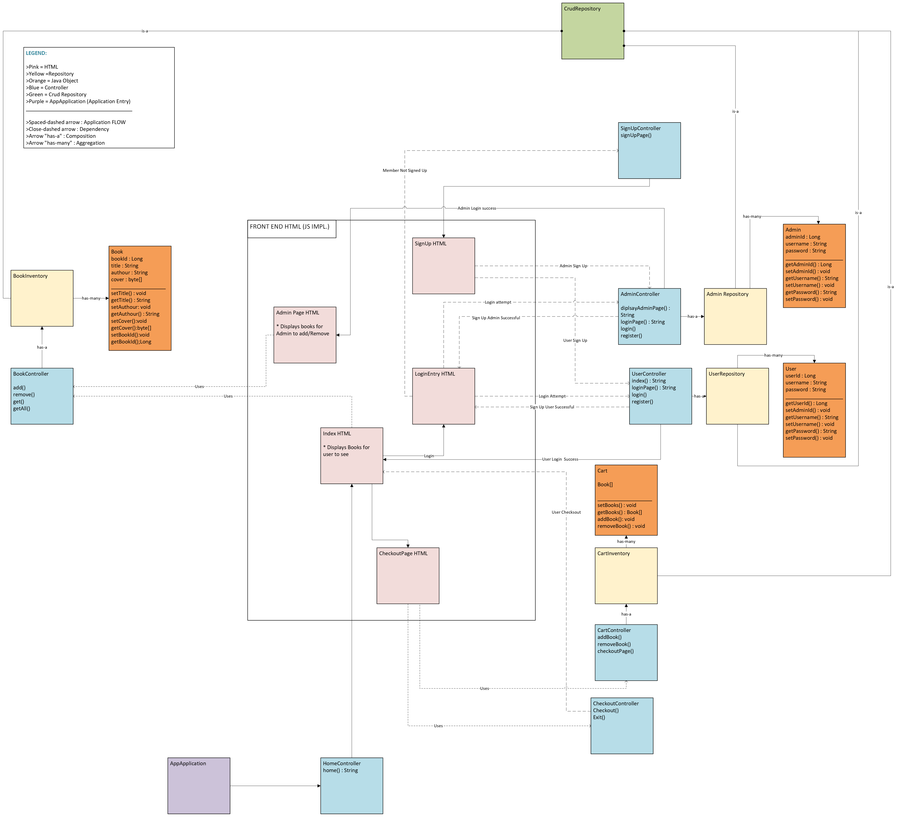
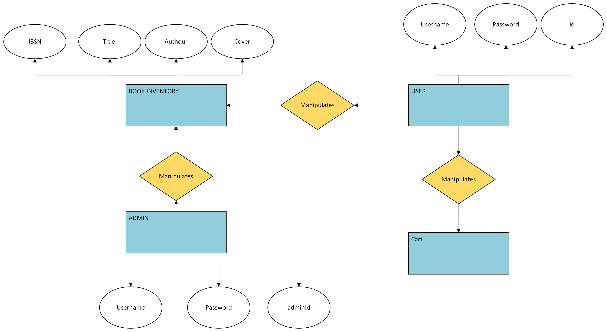
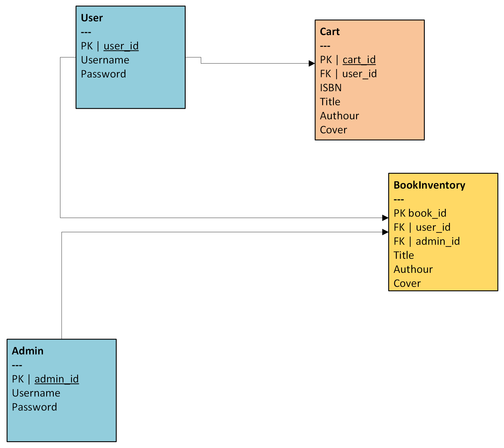

# BookStore :: Amazin.ca 🛒

A modern online bookstore application built with Spring Boot.

## Overview

Amazin.ca is an online bookstore platform that allows users to browse, search, and purchase books. The application is built using Spring Boot and can be deployed locally or accessed through Azure cloud platform.

## System Architecture

### UML Diagram



### Entity Relationship Diagram


### Entity Relationship Map


## Running the Application

There are several ways to run the BookStore application:

### 1. Using Terminal with Maven Wrapper
```bash
cd app
./mvnw spring-boot:run
```

### 2. Building and Running JAR
```bash
# Build the application
cd app
./mvnw clean package

# Run the JAR
cd target
java -jar app-0.0.1-SNAPSHOT.jar
```

### 3. Azure Cloud Deployment
Access the live application via Microsoft Azure at:
[https://amazinonlinebookstore-fzhdb7arcjctabbq.canadaeast-01.azurewebsites.net](https://amazinonlinebookstore-fzhdb7arcjctabbq.canadaeast-01.azurewebsites.net)

### 4. Google Cloud Deployment
Access the live application via Google Cloud at:
[https://amazin-sysc4806.nn.r.appspot.com/](https://amazin-sysc4806.nn.r.appspot.com/)

## Prerequisites
- Java 21 or higher
- Maven
- Internet connection (for accessing Azure deployment)

## Features
- Browse and search books
- User authentication
- Shopping cart functionality
- Order management
- Secure checkout process

## Technology
- Spring Boot
- Spring Data JPA
- Spring Security
- Maven
- Azure Cloud Services


## Support
For any issues or questions, please open an issue in the repository or contact the development team.
- [zarifkhan@cmail.carleton.ca](mailto:zarifkhan@cmail.carleton.ca)
- [arunkarki@cmail.carleton.ca](mailto:arunkarki@cmail.carleton.ca)
- [mahadahmed3@cmail.carleton.ca](mailto:mahadahmed3@cmail.carleton.ca)
- [firaselezzi@cmail.carleton.ca](mailto:firaselezzi@cmail.carleton.ca)
- [ilyaashussein@cmail.carleton.ca](mailto:ilyaashussein@cmail.carleton.ca)


## TODO:
- Security
- Payment Methods (ex. Credit cards)
- Filter/Sort
- Book Recommedations

## License
Copyright 2024 Amazin.ca

Permission is hereby granted, free of charge, to any person obtaining a copy of this software and associated documentation files (the “Software”), to deal in the Software without restriction, including without limitation the rights to use, copy, modify, merge, publish, distribute, sublicense, and/or sell copies of the Software, and to permit persons to whom the Software is furnished to do so, subject to the following conditions:

The above copyright notice and this permission notice shall be included in all copies or substantial portions of the Software.

THE SOFTWARE IS PROVIDED “AS IS”, WITHOUT WARRANTY OF ANY KIND, EXPRESS OR IMPLIED, INCLUDING BUT NOT LIMITED TO THE WARRANTIES OF MERCHANTABILITY, FITNESS FOR A PARTICULAR PURPOSE AND NONINFRINGEMENT. IN NO EVENT SHALL THE AUTHORS OR COPYRIGHT HOLDERS BE LIABLE FOR ANY CLAIM, DAMAGES OR OTHER LIABILITY, WHETHER IN AN ACTION OF CONTRACT, TORT OR OTHERWISE, ARISING FROM, OUT OF OR IN CONNECTION WITH THE SOFTWARE OR THE USE OR OTHER DEALINGS IN THE SOFTWARE.
